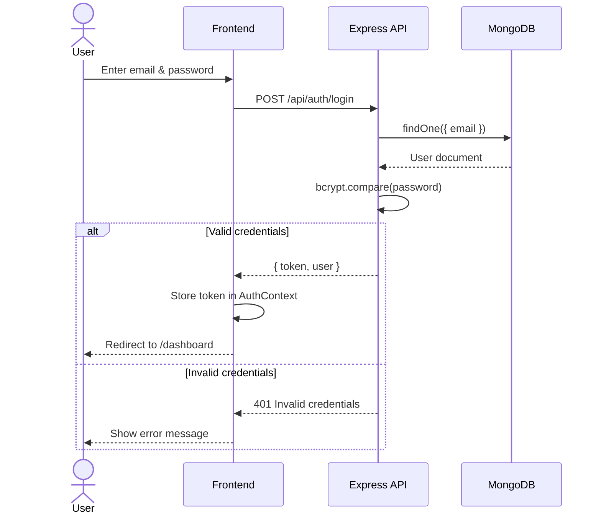
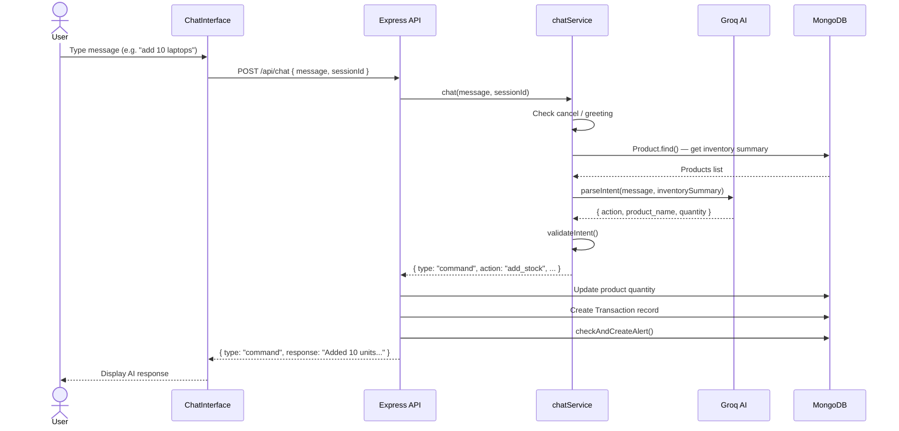
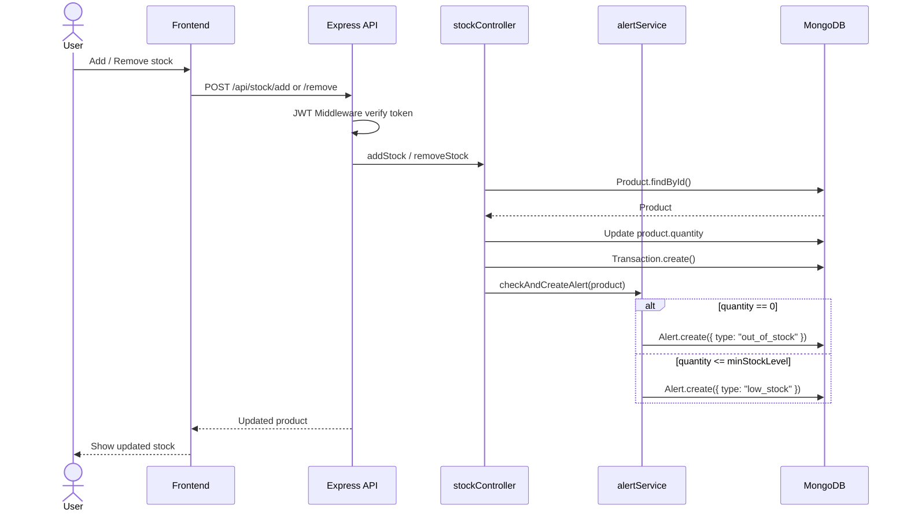
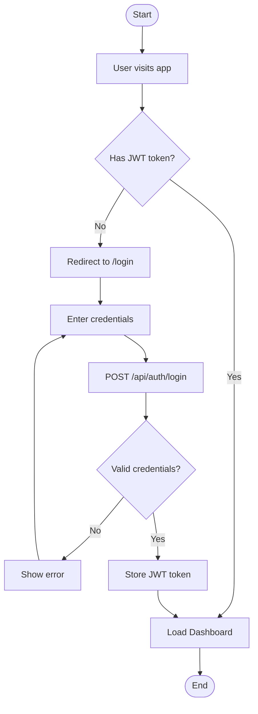
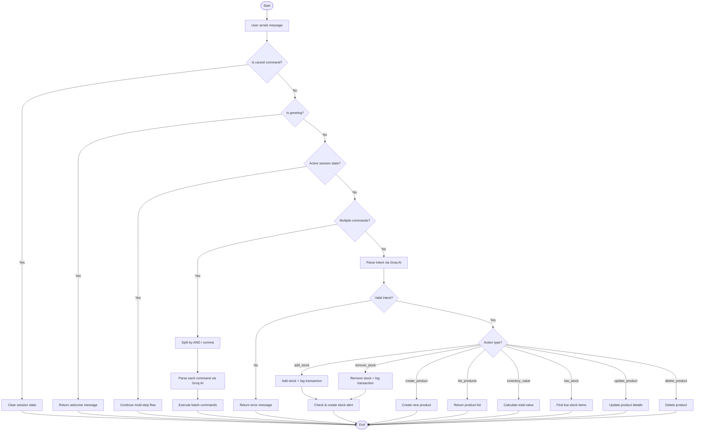
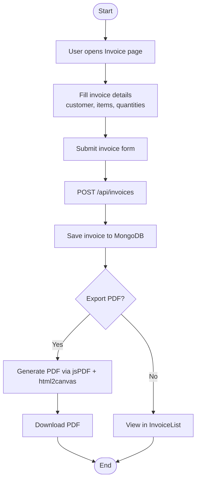
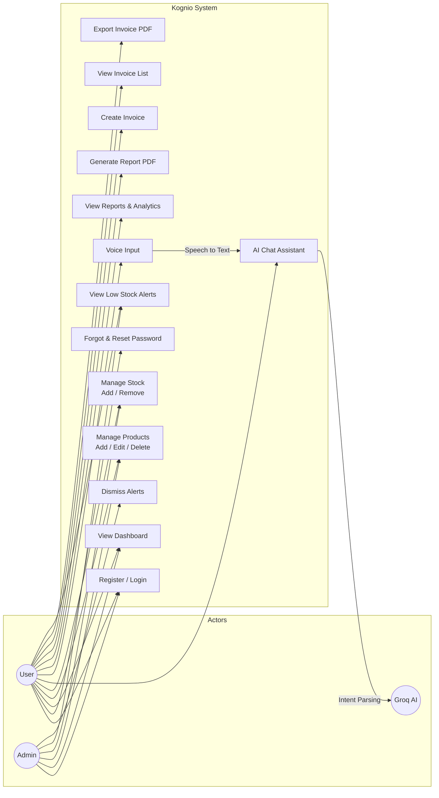

# Kognio — System Diagrams

---

## 1. System Architecture Diagram

```mermaid
graph TB
    subgraph Client["🖥️ Frontend (React + Vite)"]
        UI[React UI]
        AC[AuthContext]
        IC[InventoryContext]
        SVC[Services Layer<br/>api.js / authService / chatService / productService]
    end

    subgraph Server["⚙️ Backend (Node.js + Express)"]
        API[Express Server<br/>server.js]
        subgraph Routes
            AR[/api/auth]
            PR[/api/products]
            SR[/api/stock]
            CR[/api/chat]
            IR[/api/invoices]
            RR[/api/reports]
        end
        subgraph Controllers
            AC2[authController]
            PC[productController]
            SC[stockController]
            CC[chatController]
        end
        subgraph Services
            CS[chatService]
            AS[alertService]
            RS[reportService]
            SS[sessionStateService]
        end
        MW[JWT Auth Middleware]
    end

    subgraph External["☁️ External Services"]
        GROQ[Groq AI API<br/>llama-3.3-70b]
        MAIL[Gmail SMTP<br/>Nodemailer]
    end

    subgraph DB["🗄️ MongoDB Atlas"]
        U[(Users)]
        P[(Products)]
        T[(Transactions)]
        AL[(Alerts)]
        IN[(Invoices)]
        CA[(Categories)]
    end

    UI --> SVC
    SVC -->|HTTP + JWT| API
    API --> MW --> Routes
    AR --> AC2
    PR --> PC
    SR --> SC
    CR --> CC
    CC --> CS
    CS -->|Intent Parsing| GROQ
    PC --> AS
    SC --> AS
    AC2 -->|Reset Email| MAIL
    PC & SC & CC --> DB
    AC2 --> U
```

---

## 2. Sequence Diagram

### 2a. User Login Flow



### 2b. AI Chat Flow



### 2c. Stock Management Flow



---

## 3. Activity Diagram

### 3a. User Authentication Activity



### 3b. AI Chat Command Activity



### 3c. Invoice Generation Activity



---

## 4. Use Case Diagram


